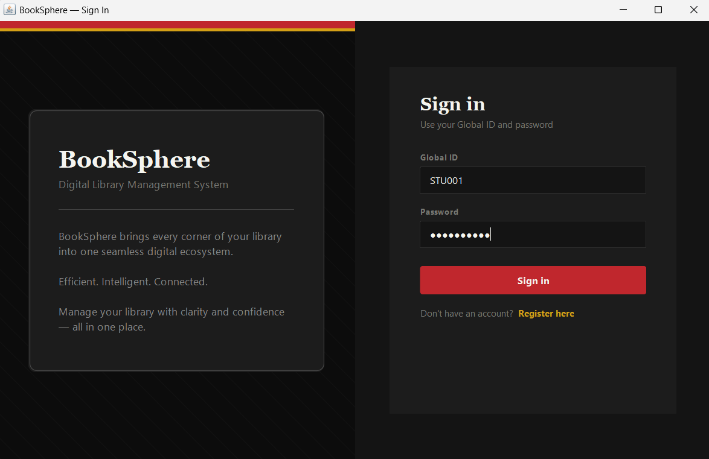
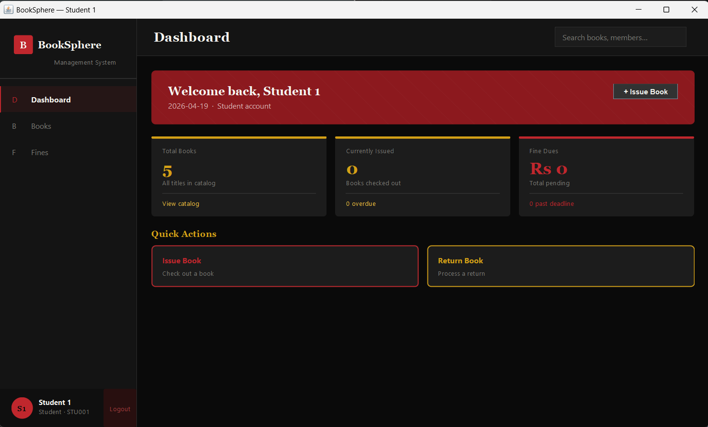
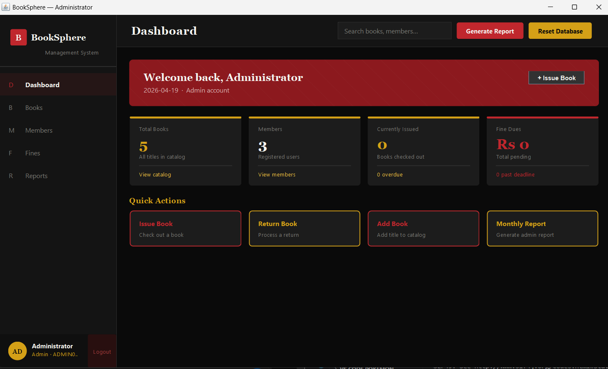
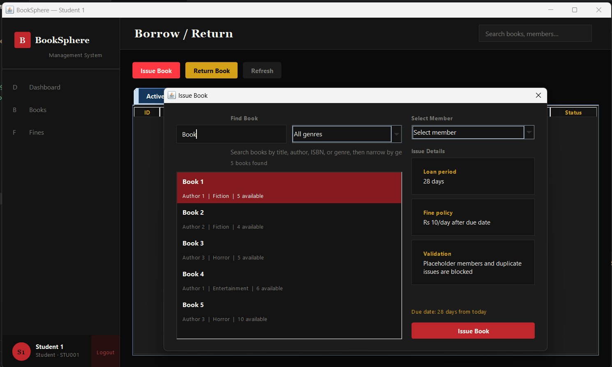

# BookSphere – Library Management System

A modern **Java-based Library Management System** built using **Java Swing (GUI)** and **SQLite (database)** with a clean UI and full CRUD functionality.

---

## Features

* User Authentication (Login/Register)
* Role-based access (Admin, Member, Student)
* Book Management (Add, Update, Delete, Search)
* Borrow & Return System
* Fine Calculation for overdue books
* Reports generation (Admin only)
* Modern dark-themed UI (Java Swing)

---

## Tech Stack

* **Language:** Java
* **UI:** Java Swing
* **Database:** SQLite
* **Build Tool:** Maven
* **Testing:** JUnit

---

## Project Structure

```
librarymanagement/
 ├── src/main/java/com/library/
 │   ├── dao/        # Data Access Layer
 │   ├── db/         # Database Manager
 │   ├── model/      # Data Models
 │   ├── ui/         # Swing UI Panels
 │   └── Main.java   # Entry point
 │
 ├── src/test/java/  # JUnit test cases
 ├── pom.xml         # Maven configuration
 └── .gitignore
```

---

## Setup & Run

### 1️. Clone the repository

```
git clone https://github.com/YOUR_USERNAME/BookSphere.git
cd BookSphere
```

### 2. Build the project

```
mvn clean install
```

### 3. Run the application

```
mvn exec:java
```

---

## Database

* Uses **SQLite**
* Database file is created automatically on first run
* Tables are initialized via `DatabaseManager`

---

## Testing

Run tests using:

```
mvn test
```

Includes:

* Login tests
* Issue/Return tests
* DAO layer testing

---

## Notes

* Database files (`*.db`) are excluded using `.gitignore`
* Maven dependencies are managed via `pom.xml` (not `.m2`)
* Designed as part of academic project (B.Tech CSE)

---

## Screenshots

### Login


### Dashboard



### Book Borrowing Page


### Report
![Report] (screenshots/Report.png)

---


## License

This project is licensed under the MIT License.

---

## If you like this project

Give it a ⭐ on GitHub!
